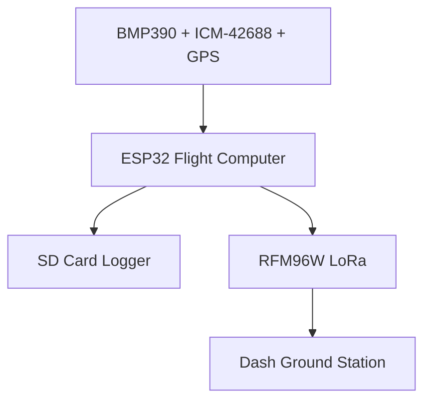

# 🚀 ROCKET M1-MK0

> Simulation-first experimental research airframe | Biomimetic Design | ESP32 Avionics

[](https://github.com/draken-hk7/ROCKET-M1--MK0/actions/workflows/ci.yml)


## Vehicle at a Glance

| Spec | Value |
|---|---:|
| Airframe diameter | 76 mm |
| Vehicle length | 1200 mm |
| Nose cone | 228 mm von Karman ogive |
| Fin count | 3 |
| Fin sweep | 33.98 deg |
| Avionics | ESP32, BMP390, ICM-42688, GPS, LoRa, SD |
| Static margin | generated by `simulation/aerodynamics.py` |
| Drag coefficient | generated by `simulation/aerodynamics.py` |

## Fibonacci & Nature Geometry

ROCKET M1-MK0 uses biomimetic geometry as an organizing principle:

- Fibonacci fin sweep: `21 deg x phi = 33.98 deg`
- Golden-ratio fin span/root relationship
- Phyllotaxis parachute bay vent layout
- Voronoi fin lattice for mass/stiffness trade studies
- Hexagonal avionics and recovery bay bulkhead patterns
- Phi-weighted complementary sensor fusion in firmware
- Golden-ratio ground-station dashboard layout

## Repository Structure

```text
config/        vehicle constants and mass properties
utils/         Fibonacci, phyllotaxis, Voronoi, catenary, spiral geometry
cad/           parametric airframe CAD generators and exports
simulation/    Barrowman aero, trajectory, structure, optimization
firmware/      ESP32 Arduino flight-computer firmware
telemetry/     Dash ground station and CSV replay
electronics/   schematic notes, wiring diagram, electronics BOM
cfd/           OpenFOAM external-aero case and post-processing
bom/           structural and merged BOMs
docs/          engineering specification and safety documents
renders/       side profile, anatomy, fin detail, reference sheets
tests/         pytest validation for geometry, aero, firmware logic
```

## Quick Start

```powershell
python utils/nature_geometry.py
python simulation/aerodynamics.py
python cad/full_assembly.py
```

Run the full validation suite:

```powershell
python -m pytest tests/ -v --tb=short
python -m compileall .
```

## Aerodynamics Summary

The primary aerodynamic workflow is:

```powershell
python simulation/aerodynamics.py
```

It writes:

- `outputs/altitude_vs_time.png`
- `outputs/velocity_vs_mach.png`
- `outputs/static_margin_diagram.png`
- `outputs/cp_cm_diagram.svg`
- `simulation/ROCKET_M1_MK0.ork`

## Avionics Architecture



## Electronics BOM Summary

Electronics BOM: `electronics/bom_electronics.csv`

Merged BOM:

```powershell
python bom/bom_full_merged.py
```

## CFD Setup

External aerodynamics case:

```text
cfd/external_aero/
```

Solver: `simpleFoam`, incompressible, turbulent k-omega SST, 85 m/s inlet.

## Safety Notice

This is a non-propellant educational airframe project. It contains no
combustion chemistry, propellant handling, pressure-vessel fabrication
specifications, ignition systems, or energetic deployment designs. All CAD,
FEA, CFD, avionics, and telemetry outputs are educational estimates, not
certification or fabrication release data.

## License

MIT License. See `LICENSE`.
