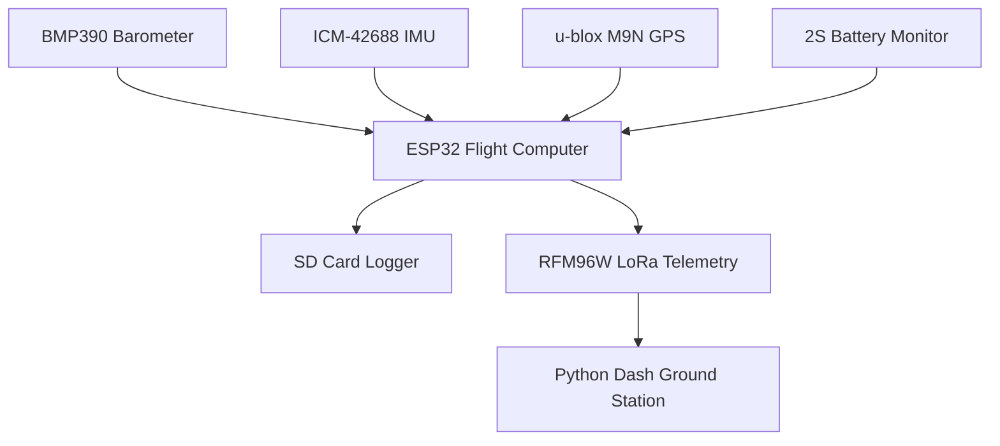
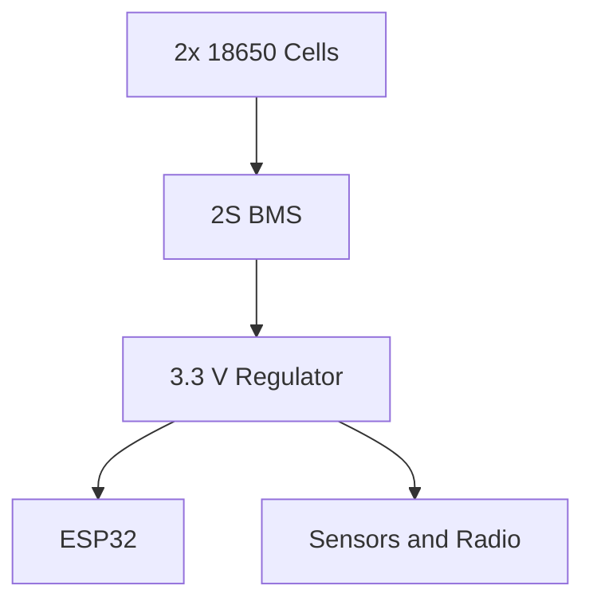
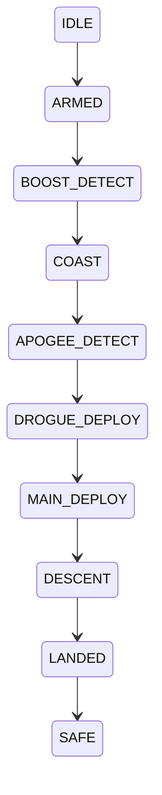

# System Architecture

## Data Flow

```mermaid
graph TD
  BMP390["BMP390 Barometer"] --> ESP32["ESP32 Flight Computer"]
  IMU["ICM-42688 IMU"] --> ESP32
  GPS["u-blox M9N GPS"] --> ESP32
  Battery["2S Battery Monitor"] --> ESP32
  ESP32 --> SD["SD Card Logger"]
  ESP32 --> LoRa["RFM96W LoRa Telemetry"]
  LoRa --> Ground["Python Dash Ground Station"]
```

## Power Tree

```mermaid
graph TD
  Cells["2x 18650 Cells"] --> BMS["2S BMS"]
  BMS --> Reg["3.3 V Regulator"]
  Reg --> ESP32
  Reg --> Sensors["Sensors and Radio"]
```

## Flight State Machine

```mermaid
stateDiagram-v2
  IDLE --> ARMED
  ARMED --> BOOST_DETECT
  BOOST_DETECT --> COAST
  COAST --> APOGEE_DETECT
  APOGEE_DETECT --> DROGUE_DEPLOY
  DROGUE_DEPLOY --> MAIN_DEPLOY
  MAIN_DEPLOY --> DESCENT
  DESCENT --> LANDED
  LANDED --> SAFE
```

All deployment names are simulation events and serial/SD log flags only.
